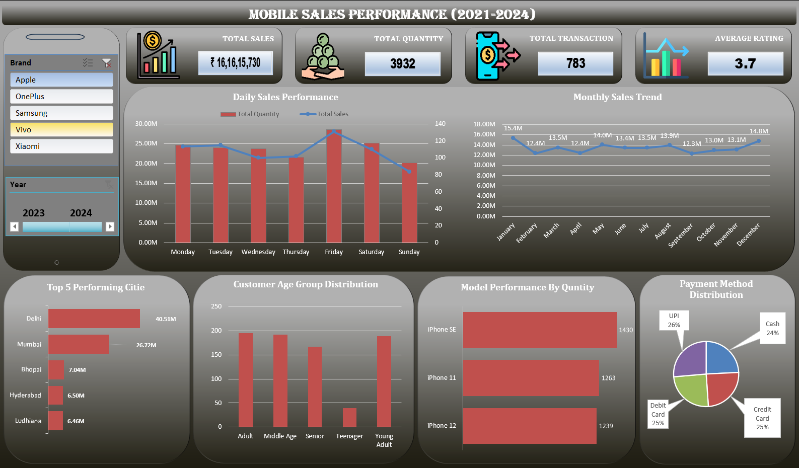

# Mobile Sales Performance (2021–2024)

## 📌 Purpose

The purpose of this project is to analyze **mobile sales data from 2021 to 2024** and create a clear **year-wise sales report** using Microsoft Excel.

The analysis helps compare yearly sales performance and understand changes in **sales, units sold, transactions, brands, cities, and customer behavior** over the four-year period.

## 🛠️ Tools & Technologies
* Microsoft Excel
* Excel Formulas
* Pivot Tables
* Pivot Charts
* Data Cleaning
* Data Analysis
* Excel Dashboard
* Slicers & Filters

## 📂 Data Source
* **Data Period:** 2021–2024
* **Total Records:** 3,835 transactions
* **Total Columns:** 12
* **File Format:** Excel (`.xlsx`)
* **Source:** [📥 View / Download Dataset](https://github.com/kasarprasad777-dot/Mobile-Sales-Excel-Dashbord-/blob/main/Mobile%20Sales%20Data.xlsx)

## 📊 Dashboard Preview

[📥 Download Dashbord Dashboard (.xlsx)](https://github.com/kasarprasad777-dot/Mobile-Sales-Excel-Dashbord-/blob/22820a0f67309f7159d316779b7d89882399ac8a/Mobile%20Sales%20Performance%20(2021%E2%80%932024).xlsx)

